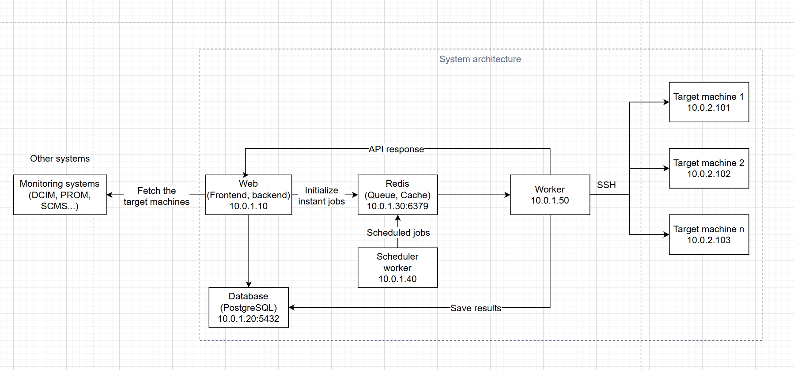

# System Checklist Tool

Ứng dụng web tự động hóa đánh giá checklist cho hệ thống Cloud - từ các thành phần vật lý (máy chủ, storage, SAN switches) đến hệ điều hành (CentOS, Ubuntu, Oracle, etc.).

## Kiến trúc hệ thống



## Tính năng chính

### Frontend (ReactJS)
- **Dashboard**: Hiển thị lịch sử chạy checklist gần nhất + sơ đồ thống kê
- **Quản lý Checklist**: Tạo, cập nhật, chỉnh sửa checklist YAML
- **Quét IP**: Lấy IP từ DCIM/PROM hoặc nhập thủ công
- **Báo cáo**: Hiển thị kết quả scan và tải xuống file Excel

### Backend (Python)
- **API Integration**: Kết nối DCIM + PROM để lấy danh sách IP
- **Ansible Runner**: Thực thi playbook để lấy thông tin cấu hình OS
- **Report Generation**: Tạo báo cáo Excel từ kết quả scan
- **Database**: PostgreSQL để lưu trữ dữ liệu
- **Queue**: Redis cho xử lý task bất đồng bộ

## Cài đặt và chạy

### Yêu cầu hệ thống
- Python 3.8+
- Node.js 16+
- PostgreSQL
- Redis
- Ansible

### Backend
```bash
cd backend
python3 -m venv venv
source venv/bin/activate  # Linux/Mac
# hoặc venv\Scripts\activate  # Windows
pip install -r requirements.txt
python3 app.py
```

### Frontend
```bash
cd frontend
npm install
npm start
```

## Cấu trúc dự án
```
system-checklist-tool/
├── frontend/          # ReactJS application
├── backend/           # Python Flask API
├── ansible/           # Ansible playbooks
```

## Tính năng tương lai
- Tự động checklist rủi ro định kỳ
- Đánh giá node dịch vụ
- Đề xuất fix cho tiêu chí chưa đạt
